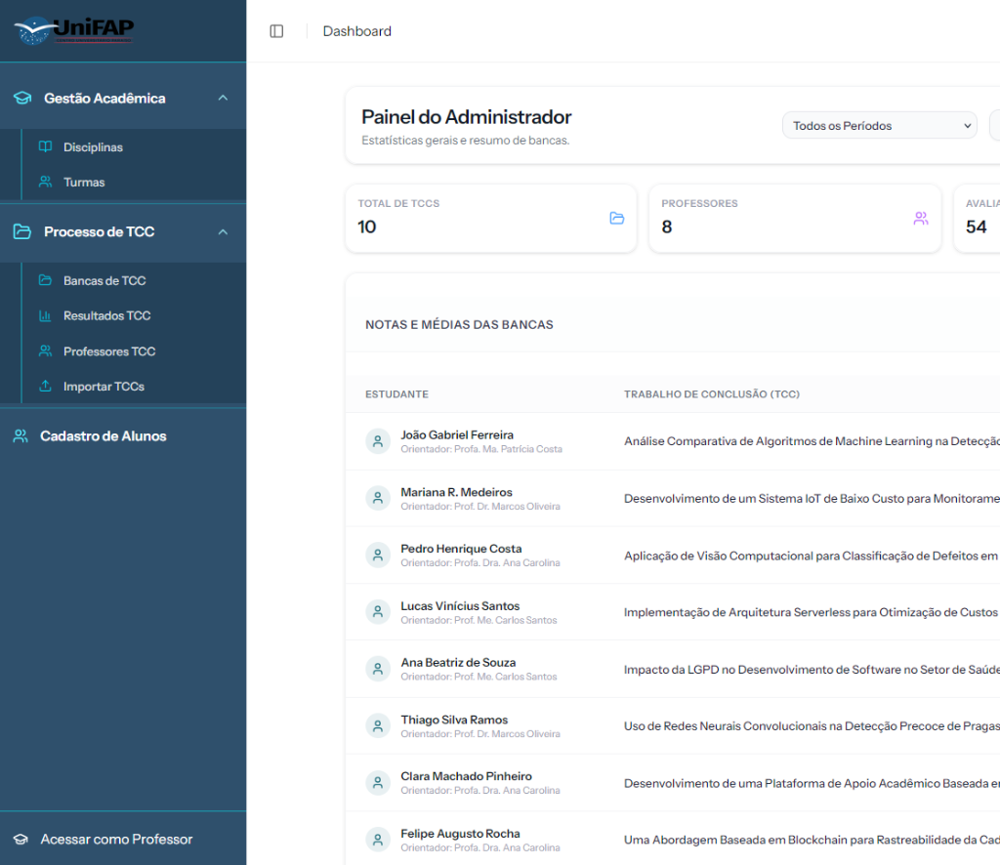
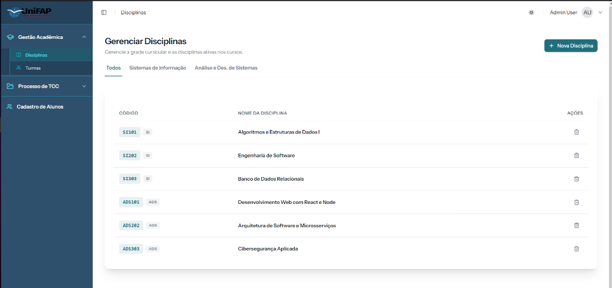
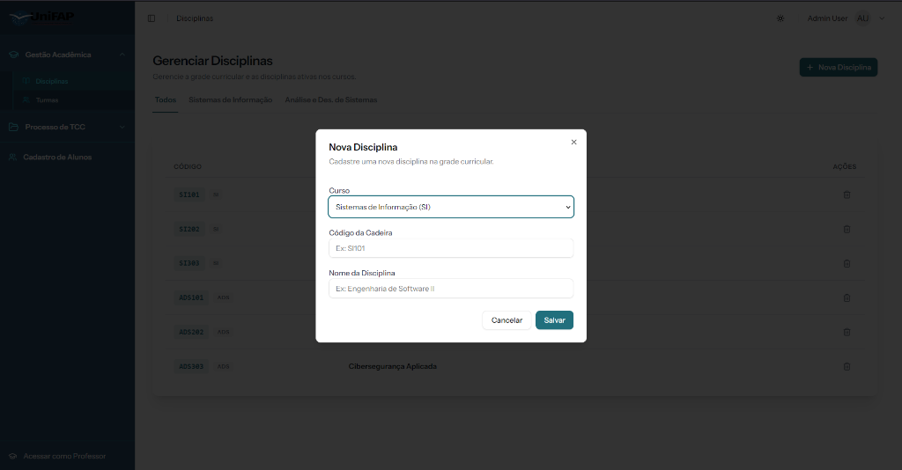
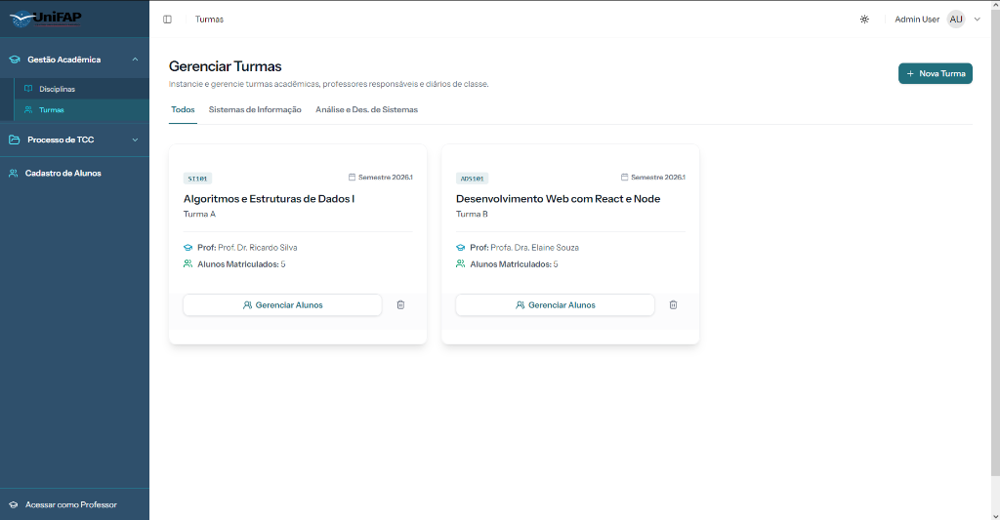
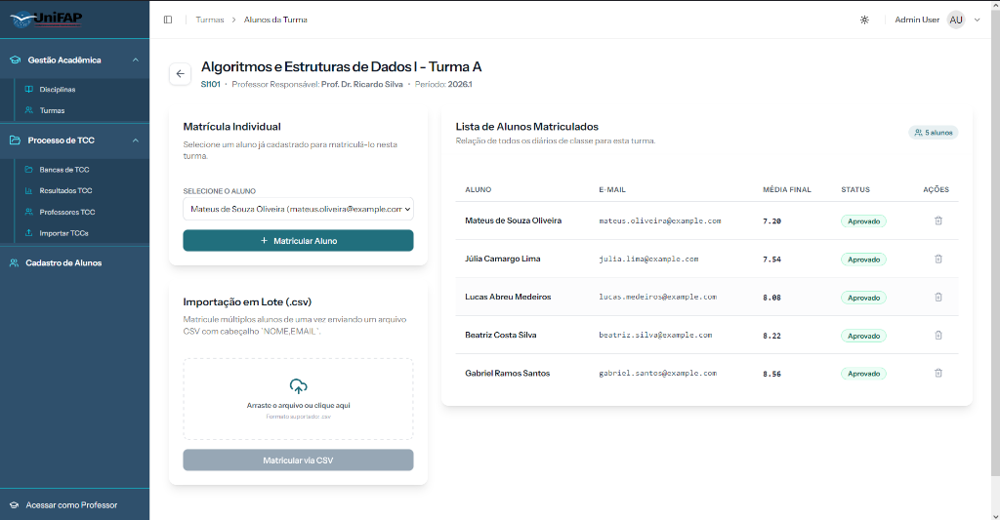
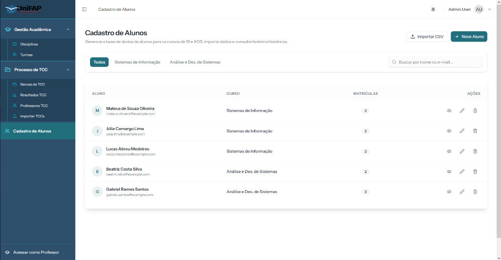
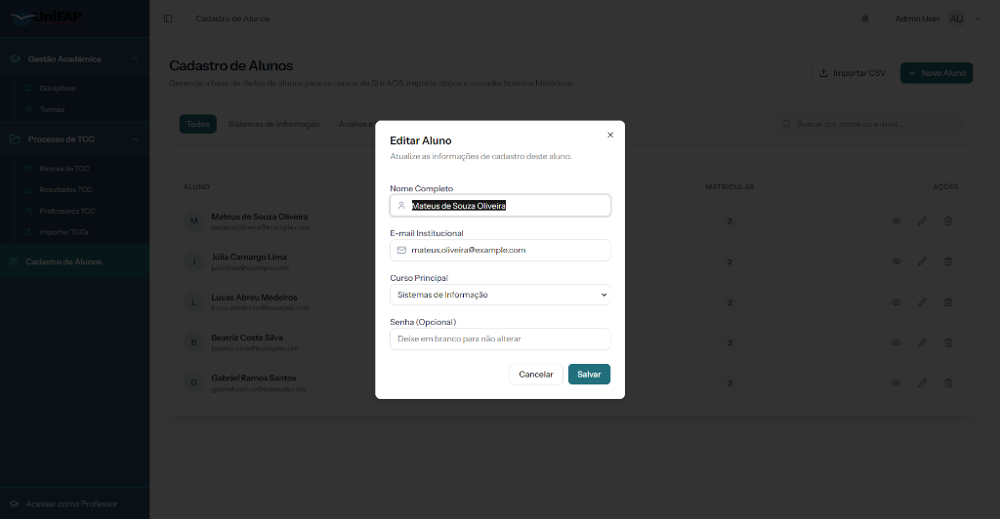
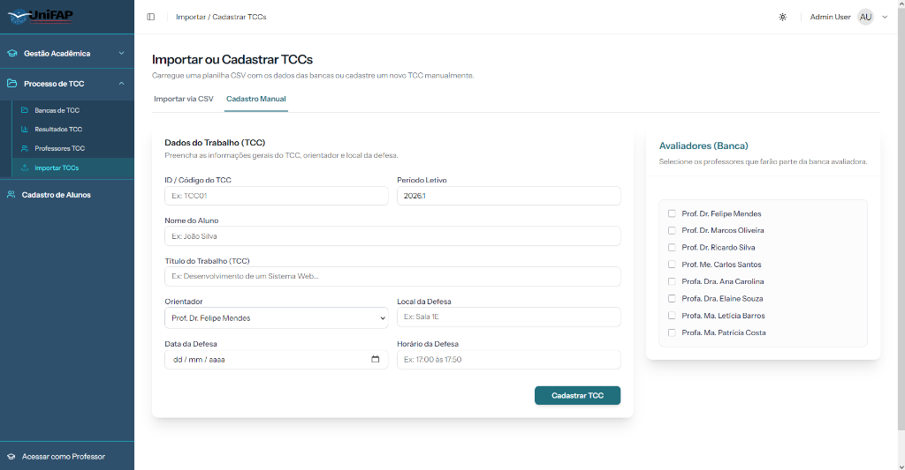
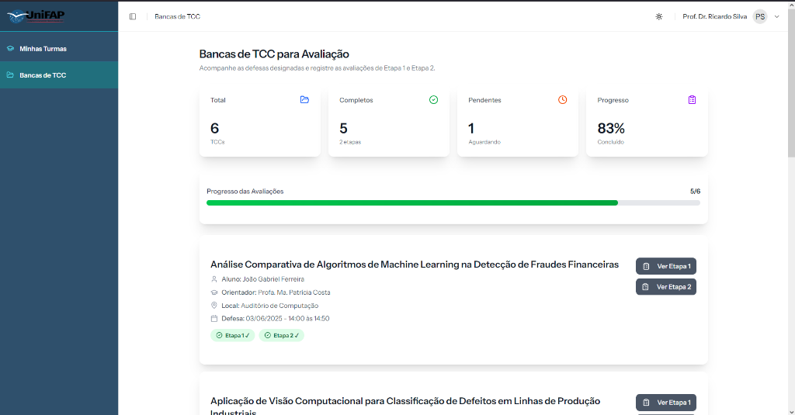
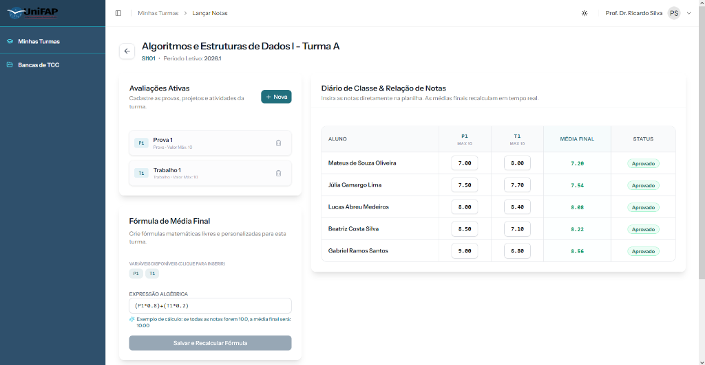

# Sistema de Gerenciamento e Avaliação de TCCs

Sistema web para gerenciar e avaliar Trabalhos de Conclusão de Curso (TCCs) e disciplinas acadêmicas. Permite que administradores gerenciem TCCs e professores, enquanto docentes realizam avaliações de bancas e orientandos.

**Stack:** Laravel 12 · React 19 · TypeScript · Inertia.js · Tailwind CSS 4 · PostgreSQL · Docker · Nginx

---

## 📸 Demonstração das Implementações

### 1. Novo Menu Lateral e Divisão de Abas
O menu lateral foi reestruturado de forma limpa e moderna, agrupando as funcionalidades do sistema: **Gestão Acadêmica** (que engloba a administração de disciplinas e turmas) e **Processo de TCC**. A opção antiga "Ambiente do Curso" foi removida da barra lateral.



### 2. Gestão de Disciplinas por Curso
Agora é possível visualizar e gerenciar a grade curricular filtrando por abas dinâmicas de cada curso (Sistemas de Informação e Análise e Des. de Sistemas).



### 3. Cadastro de Nova Disciplina
Formulário interativo com seleção explícita do curso associado para a nova disciplina cadastrada.



### 4. Gestão de Turmas por Curso
As turmas agora ficam organizadas em formato grid, filtradas por abas com base nos cursos e exibindo o professor responsável e a quantidade de alunos matriculados.



### 5. Matrícula de Alunos e Diário de Classe (Roster)
Permite a matrícula de alunos nas turmas de forma individual ou em lote (via arquivo CSV). Exibe a relação detalhada dos alunos com média final calculada a partir de fórmulas dinâmicas, status e ações rápidas.



### 6. Cadastro e Importação de Alunos
Painel centralizado de cadastro de alunos, onde é possível visualizar a relação de alunos por curso (SI e ADS), buscar por nome ou e-mail, matricular de forma manual ou importar dados em lote (via arquivo CSV).



### 7. Edição de Informações de Cadastro do Aluno
Modal interativo para atualizar as informações de cadastro do aluno (Nome, E-mail, Curso Principal e alteração de senha opcional).



### 8. Cadastro Manual de TCCs e Atribuição de Bancas
A página de **Importar TCCs** agora oferece duas abas de trabalho: importação em lote por planilha CSV ou cadastro manual detalhado. O administrador pode preencher todas as informações do trabalho, associar um professor orientador e selecionar com flexibilidade os professores que irão compor a banca avaliadora.



### 9. Painel do Professor - Bancas de TCC
Acesso dedicado para os docentes acompanharem o andamento, os dados e realizarem o lançamento de notas das etapas 1 e 2 das bancas em que participam ou orientam.



### 10. Painel do Professor - Gestão de Notas e Cálculo de Média
Dentro do menu **Minhas Turmas**, os docentes têm total controle sobre o diário de classe. É possível cadastrar avaliações (provas, projetos e trabalhos) de forma dinâmica, atribuir notas diretamente aos alunos, e definir fórmulas matemáticas customizadas para o cálculo automático da média final em tempo real.



---

## 🚀 Início Rápido (Desenvolvimento Local)

### Pré-requisitos
- [Docker Desktop](https://www.docker.com/products/docker-desktop/) instalado e em execução

### 1. Clonar e configurar o ambiente

```bash
git clone <url-do-repositorio>
cd tcc-platform-remake

cp .env.example .env
```

### 2. Gerar o APP_KEY

O `APP_KEY` é obrigatório para criptografia de sessões e cookies. Gere um e coloque no `.env`:

```bash
# Opção A — se tiver PHP instalado localmente:
php -r "echo 'APP_KEY=base64:' . base64_encode(random_bytes(32)) . PHP_EOL;"

# Opção B — usando o Docker (sem PHP local):
docker run --rm php:8.3-alpine php -r "echo 'APP_KEY=base64:' . base64_encode(random_bytes(32)) . PHP_EOL;"
```

> **Atenção:** Se você não definir o `APP_KEY` no `.env`, o container irá gerar um automaticamente e exibirá no log. Copie-o e adicione ao `.env` para que ele persista entre restarts.

### 3. Subir os containers

```bash
docker compose up -d --build
```

O container irá automaticamente:
- ✅ Aguardar o banco de dados ficar disponível
- ✅ Executar as migrations
- ✅ Popular o banco com dados iniciais (seed) na primeira execução
- ✅ Cachear configurações, rotas e views

### 4. Acessar a aplicação

- **URL:** http://localhost:8000
- **Admin:** `admin@example.com` / `password`

---

## 🖥️ Deploy em VPS/Produção

### Pré-requisitos
- Docker Engine + Docker Compose instalados no servidor
- Porta 80 liberada no firewall

```bash
# 1. Clonar o repositório no servidor
git clone <url-do-repositorio>
cd tcc-platform-remake

# 2. Criar e configurar o .env
cp .env.example .env
nano .env
```

Variáveis obrigatórias para produção:

```env
APP_KEY=base64:...          # Gere com o comando acima
APP_URL=https://seusite.com.br
APP_ENV=production
APP_DEBUG=false

DB_DATABASE=tcc_database
DB_USERNAME=tcc_user
DB_PASSWORD=sua_senha_segura
```

```bash
# 3. Subir com o compose de produção
docker compose -f docker-compose.prod.yml up -d --build
```

### Atualizando a aplicação na VPS

```bash
git pull
docker compose -f docker-compose.prod.yml up -d --build
# O entrypoint executa as migrations automaticamente
```

---

## 📦 Comandos Disponíveis (Makefile)

```bash
make setup          # Build completo + up + migrations + seed
make up             # Subir containers
make down           # Parar containers
make rebuild        # Rebuild completo da imagem
make logs           # Ver logs em tempo real
make bash           # Terminal dentro do container
make db-shell       # Shell do PostgreSQL
make build-assets   # Compilar assets frontend (Vite) dentro do container
make cache-clear    # Limpar todos os caches do Laravel
make prune          # Remover containers, imagens e volumes não usados
```

---

## 🏗️ Arquitetura Docker

| Arquivo | Ambiente | Observação |
|---|---|---|
| `docker-compose.yml` | Desenvolvimento local | Volumes nomeados — sem bind mount NTFS |
| `docker-compose.prod.yml` | VPS / Produção | Código dentro da imagem, sem volumes de código |
| `Dockerfile` | Ambos | Multi-stage: Node 20 → Composer 2 → PHP 8.3 Alpine |

---


## 👥 Funcionalidades

### 👑 Administrador
- Dashboard com estatísticas gerais
- Importação de TCCs via CSV
- Gestão de professores e turmas
- Relatórios com médias por etapa e média final
- Exportação de resultados em CSV

### 👨‍🏫 Professor
- Login via nome ou e-mail + senha
- Lista de TCCs atribuídos (banca e orientandos)
- Avaliação de TCCs nas etapas 1 e 2

---

## 📝 Licença

Este projeto está sob a licença MIT.
